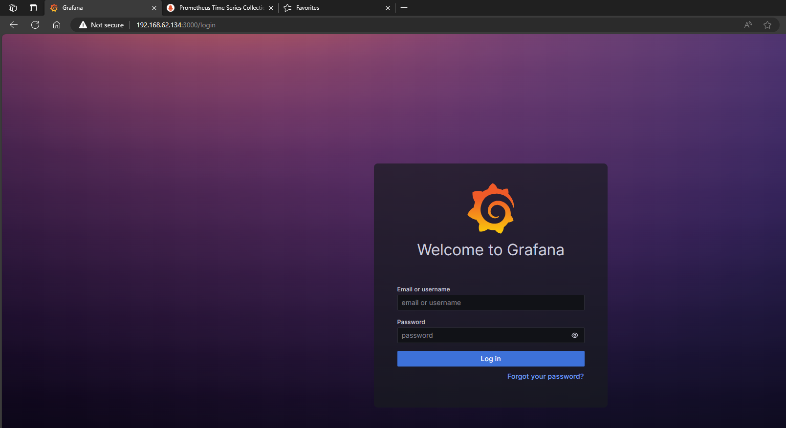
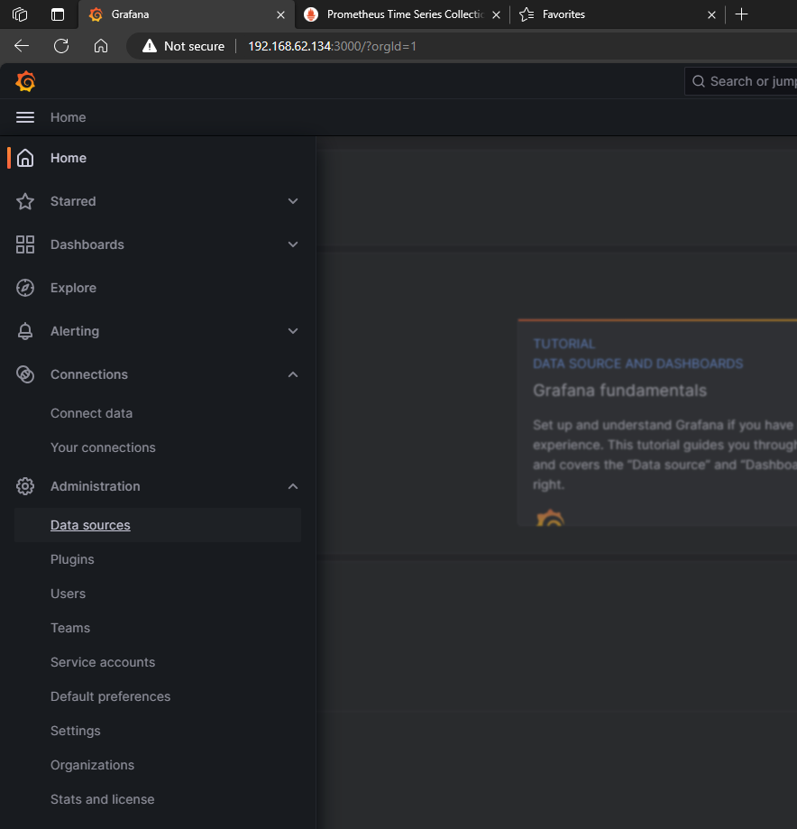
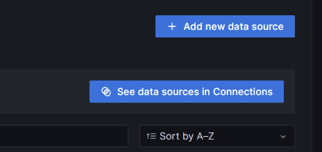
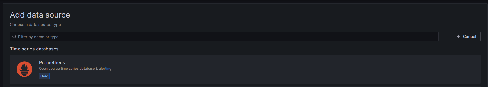
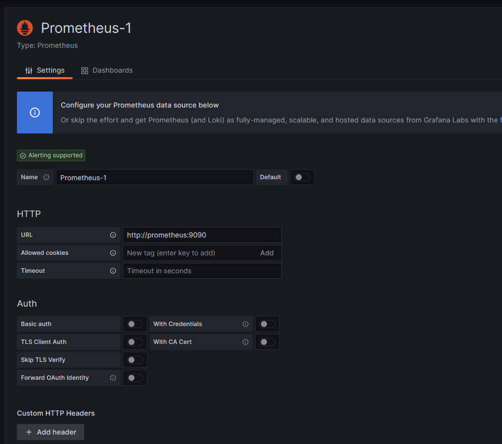
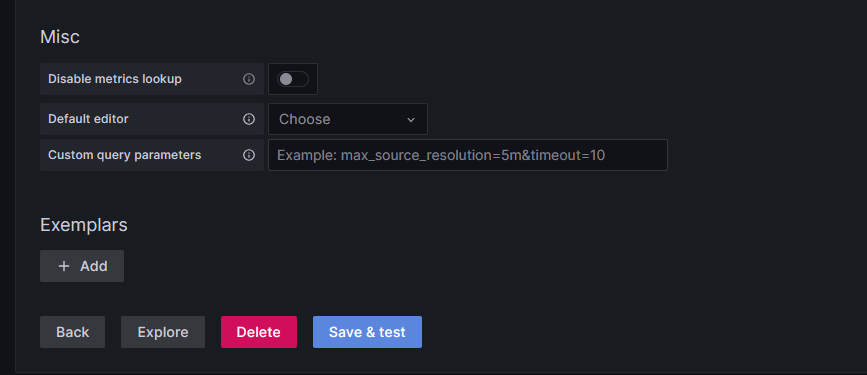
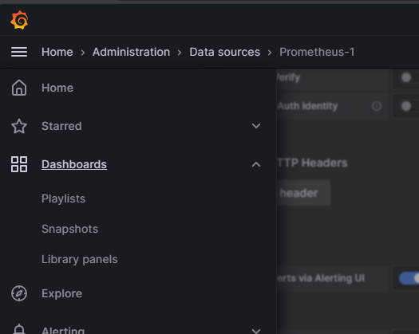
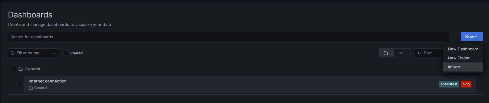
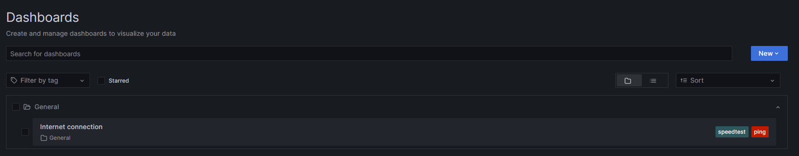
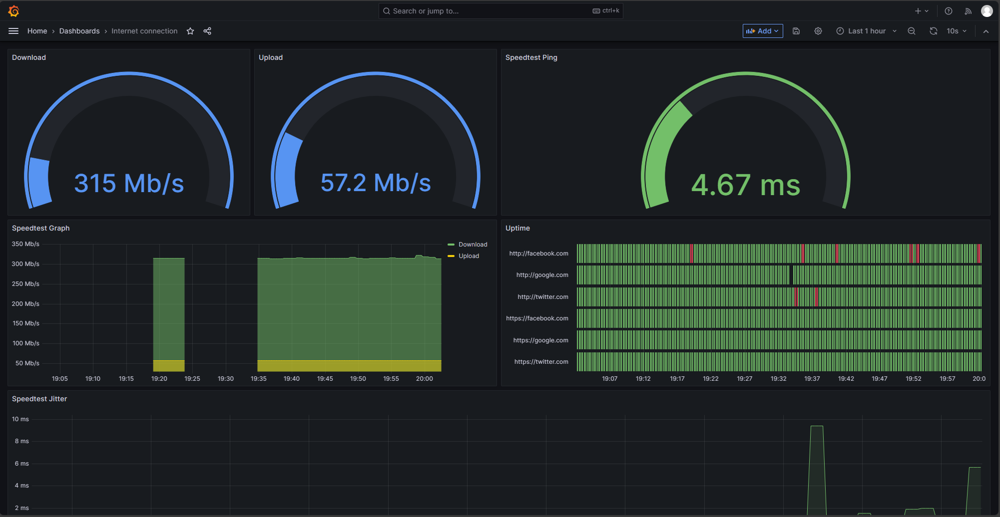

# Internet Service Monitoring

## Intro
This little deployment using Docker Compose makes complete Internet Service Monitoring, tracking Download/Upload speed tests, ping successes, metrics for name resolution, status codes for HTTP/HTTPS services and others.

## Overview


## Prerequisites
- Linux System (Preferred)
- Docker

## Set Up

This is gonna be our directory structure for our deployment.
```shell
internet-monitoring/
├── blackbox
│   └── config
│       └── blackbox.yml
├── docker-compose.yml
├── grafana
│   └── internet_connection_dashboard.json
├── prometheus
│   └── config
│       └── prometheus.yml
└── README.md   # This file :D
```

### `docker-compose.yml`

The first file to review is `docker-compose.yml` where we declared the necessary containers where the services will be ran.

Starting with `grafana` service:
```yaml
grafana:
    image: grafana/grafana:9.5.14
    container_name: grafana
    restart: unless-stopped
    ports:
      - 3000:3000
    volumes:
      - grafana-storage:/var/lib/grafana
```
`Grafana` is a service that allow us to create dashboards and graphs, reading info from multiple data sources, in this case reads data from `Prometheus` services, then represents the data in graphs.

This is a simple service deployment, the most important lines of this file is the port `3000` that's exposed to access using the IP of the host. And a volume attached to persist data, like dashboards and configurations in `grafana` service.

`prometheus` service:
```yaml
prometheus:
    image: bitnami/prometheus:2.48.0
    container_name: prometheus
    restart: unless-stopped
    ports:
      - 9090:9090
    volumes:
      - ./prometheus/config:/opt/bitnami/prometheus/conf
      - prometheus-storage:/opt/bitnami/prometheus/data
```
`Prometheus` is the services in charge of store metrics from multiple metric exporters, is like a database but for metrics represented by numeric values.

Here we're exposing port `9090` and attaching 2 data volumes, the first one is for the configuration, where we define where `prometheus` is gonna scrape metrics, the intervals for each scrape, the targets, etc. And the second one is for keep the data stored persistently.

`SpeedTest-Exporter` service:
```yaml
speedtest-exporter:
    image: miguelndecarvalho/speedtest-exporter
    container_name: speedtest-exporter
    ports:
      - 9798:9798
    restart: unless-stopped
```
This exporter tests the internet bandwidth, and is exposing port `9798`

`Ping` service:
```yaml
ping:
    image: prom/blackbox-exporter:latest
    restart: always
    volumes:
        - ./blackbox/config:/config
    expose:
        - 9115
    ports:
        - 9115:9115
    tty: true
    stdin_open: true
    command:
        - '--config.file=/config/blackbox.yml'
```
This exporter, named `blackbox-exporter` allow to us ping tests `icmp`, name resolution metrics and HTTP/HTTPS metrics and tests. This help us to monitor the availability of multiple type of targets, like servers, or networking devices. Also services like WebSites, testing HTTP/HTTPS over those website targets.

Docker `volumes`:
```yaml
volumes:
  grafana-storage: {}
  prometheus-storage: {}
```
Here we declared the volumes used by `Grafana` and `Prometheus`.

### `blackbox/config/blackbox.yml`

This file is divided into `modules`, where each module is for a type of test, for example, `icmp` module is for ping tests and `http_2xx` is for HTTP/HTTPS test.

```yaml
modules:
  http_2xx:
    prober: http
    http:
      preferred_ip_protocol: "ip4"
  ----
  icmp:
    prober: icmp
```
> Note: There is more modules at `blackbox.yml` config file, but are not used in this deployment.

### `grafana/internet_connection_dashboard.json`
This file contains all the data required by `Grafana` to import a dashboard. Simply import the file into `Grafana`, and it will generate a dashboard with multiple graphs displaying metrics from the above exporters

### `prometheus/config/prometheus.yml`

This file contains the config from `prometheus` service. Here we define the exporters where `prometheus` should scrape metrics, the scrape intervals, and the targets to test ping and HTTP/HTTPS tests.

`Global` section:
```yaml
# my global config
global:
  scrape_interval: 15s
  evaluation_interval: 30s
```
Here we define `scrape_interval` and `evaluation_interval`, and this applies for all the jobs, just if the job hasn't a custom `scrape_interval` or `evaluation_interval`.


`scrape_configs`:

`prometheus`:
```yaml
  - job_name: 'prometheus'
    scrape_interval: 30s
    static_configs:
      - targets: 
        - 'localhost:9090'
```
This job is for scrape metrics from itself, this is why the target is `localhost`.

`speedtest-exporter`:
```yaml
  - job_name: 'speedtest-exporter'
    scrape_interval: 1m
    scrape_timeout: 1m
    static_configs:
      - targets: 
        - 'speedtest-exporter:9798'  
```
This job is for scrape metrics from `speedtest-exporter`, prometheus will scrape metrics every minute, if the services did not respond after 1 minute is a timeout, and the target is `speedtest-exporter`.

`ping`:
```yaml
  - job_name: 'ping'
    metrics_path: /probe
    scrape_interval: 30s
    params:
      module: [http_2xx]  # Look for a HTTP 200 response.
    static_configs:
      - targets: 
        - 'https://google.com'
        - 'https://facebook.com'
        - 'https://twitter.com'
        - 'http://google.com'
        - 'http://facebook.com'
        - 'http://twitter.com'
    relabel_configs:
      - source_labels: [__address__]
        target_label: __param_target
      - source_labels: [__param_target]
        target_label: instance
      - target_label: __address__
        replacement: ping:9115  # The blackbox exporter's real hostname:port.
```
This task involves scraping metrics from `ping`, with Prometheus collecting metrics every 30 seconds. The specific module employed is `http_2xx`, which monitors HTTP 200 codes. This module is loaded from the `blackbox.yml` configuration file, targeting Google, Facebook, and Twitter for both HTTP and HTTPS.

Additionally, the configuration includes an extra parameter, `relabel_configs`, allowing for the modification of label values. This feature enables the definition of targets based on their hostnames. However, it's noteworthy that Prometheus effectively retrieves information from `ping` and transmits the "actual" targets using other metrics.

## Deployment
At this point all the services have their config files, it's time to deploy.

This can be done by running:
```shell
docker compose up -d
```
After that the services should be running.

To verify the services running can be showed by running:
```shell
docker compose ps --format "table {{.Service}}\t{{.Status}}\t{{.State}}\t{{.Ports}}"
```
Output:
```
SERVICE              STATUS                 STATE     PORTS
grafana              Up 2 hours             running   0.0.0.0:3000->3000/tcp, :::3000->3000/tcp
ping                 Up 2 hours             running   0.0.0.0:9115->9115/tcp, :::9115->9115/tcp
prometheus           Up 14 minutes          running   0.0.0.0:9090->9090/tcp, :::9090->9090/tcp
speedtest-exporter   Up 2 hours (healthy)   running   0.0.0.0:9798->9798/tcp, :::9798->9798/tcp
```

This give you a brief of all the services running in the deployment.

## Grafana Setup

Now we're going to config `grafana` to read metrics provided by `prometheus` and load the dashboard to see the graphs.

`Grafana` is exposing port `3000`, so if you're running the docker container in your own host, you should be able to access via [http://localhost:3000](http://localhost:3000), if you are not running the service in another server/system access via the IP of the another server/system [http://\<server-ip\>:3000](http://<server-ip>:3000).

You should see this login page, the default credentials are `admin:admin`.


Now got to `Data sources`.



Click on `Add new data source`.


Click on `Prometheus` option.


Fill the `URL`


Then click on `Save & test`


Once is done, prometheus should be added as data source.

Now go to Dashboards.


Click on `New` then `Import`


Import the dashboard JSON file `grafana/internet_connection_dashboard.json` and click on `Load`.


You should be able to open the `Internet connection` dashboard.


And this is the dashboard.


Now you can monitor via a friendly GUI.

## Conclusion

In summary, the deployment of a robust monitoring stack, consisting of Grafana, Prometheus, Blackbox Exporter, and Speedtest Exporter using Docker Compose, has significantly enhanced our ability to monitor critical aspects of our network infrastructure. By leveraging this comprehensive solution, we have gained valuable insights into key performance metrics, including bandwidth, jitter, resolution time, and access to multiple sites through HTTP response codes.

Grafana serves as our central visualization tool, providing intuitive and customizable dashboards that enable us to interpret complex data effortlessly. Prometheus, as the core monitoring engine, ensures real-time data collection and analysis, while the Blackbox Exporter extends our monitoring capabilities by focusing on HTTP response codes from diverse sites, such as Google, Facebook, and Twitter.

Moreover, the inclusion of the Speedtest Exporter allows us to measure and track bandwidth performance accurately. This integrated monitoring stack not only offers a holistic view of our network's health but also facilitates proactive decision-making by identifying potential issues and optimizing performance.

In conclusion, the implemented monitoring stack has proven to be a valuable asset, empowering us to maintain a high level of network performance, troubleshoot issues promptly, and ensure optimal user experiences across various online platforms.

## References
- https://www.jeffgeerling.com/blog/2021/monitor-your-internet-raspberry-pi
- https://github.com/geerlingguy/internet-pi/tree/master
- https://github.com/prometheus/blackbox_exporter/tree/master
- https://github.com/prometheus/prometheus/tree/main
- https://prometheus.io/docs/prometheus/latest/configuration/configuration/
- https://docs.miguelndecarvalho.pt/projects/speedtest-exporter/
- https://github.com/MiguelNdeCarvalho/speedtest-exporter/tree/main
